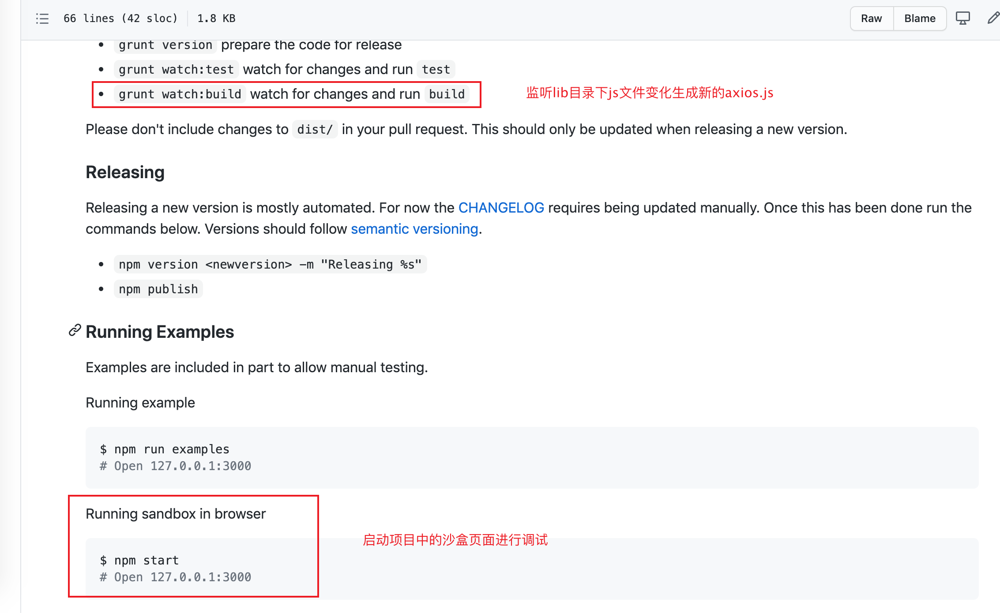

# axios源码

## 1. axios仓库地址及版本

这一次分析的`axios`源码仓库[地址](https://github.com/axios/axios)，版本是`0.20.0`，因为看源码过程中会对源码中加入自己的注释，所以特意fork到自己的仓库里面，所有的分析记录都在这个仓库里，有需要的同学可以下载，地址：[axios源码分析地址](https://github.com/TerryZwei/axios)


## 2. axios项目的启动

分析`axios`源码前，首先得启动这个源码项目，这里的`axios`并不像`jQuery`和`underscore`这一类的第三方库，可以通过单个源文件可以调试源码。平时我们使用的`axios`是通过这个项目打包出来的，所以接下来我们要做的是启动项目并通过项目的构建工具来监听源码的改变然后打包出新的`axios.js`文件。通过以下的步骤来分析如何启动和监听项目代码。

整体项目目录结构：


### 2.1 CONTRIBUTING.md

`CONTRIBUTING.md`这个文件一般是要对项目进行代码贡献的时候需要查看的文件，通过这个文件知道项目是通过`grunt+webpack`来构建的，执行构建命令：`grunt watch:build`，通过监听lib目录下js文件变化，生成最终文件到dist目录下。还可以利用项目里面的沙盒环境进行调试（`npm start`），项目的沙盒环境引用的就是dist目录下的axios.js文件。



## 3. axios源码分析

项目是通过`grunt+webpack`构建，`webpack.config.js`的入口文件是`index.js`。


### 3.2 项目入口文件

文件里面只有一个简单的引用`module.exports = require('./lib/axios');`，所以真正的开始文件应该是lib目录下的`axios.js`文件。


## axios源码优点

1. 函数表达式都有具体的函数名，这样对于代码的可读性和理解性都很重要，而且如果没有函数名，那么匿名函数在栈追踪不会显示有意义的函数名，调试会变得困难。

```js
...
// 这里的函数表达式有具体的函数名create，对于理解和调试非常有帮助
axios.create = function create(instanceConfig) {
  return createInstance(mergeConfig(axios.defaults, instanceConfig));
};
...
```