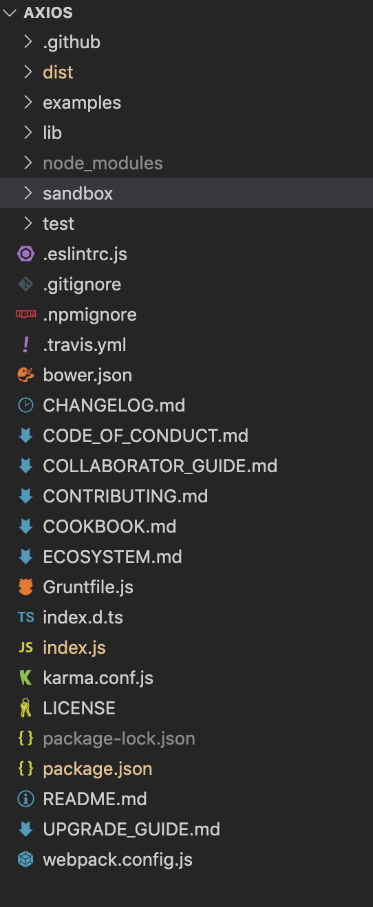

# axios源码解读（上）

通过源码的学习提升自己的编码能力和理解源码里面的设计模式，最终通过自己的理解，然后模仿做一个简易功能版本的轮子出来。希望通过这个源码系列来监督自己学习源码。


## 1. axios仓库地址及版本

这一次分析的`axios`源码仓库[地址](https://github.com/axios/axios)，版本是`0.20.0`，因为看源码过程中会对源码中加入自己的注释，所以特意保存到自己的仓库里面，所有的分析记录都在这个仓库里，有需要的同学可以下载，地址：[axios源码分析地址](https://github.com/TerryZwei/axios-sourcecode-study)


## 2. axios源码目录

克隆`axios`源码[地址](https://github.com/axios/axios)到本地，然后对目录进行分析。源码学习中需要对代码进行断点调试，那么这个时候就要知道项目代码是怎么运行起来的。这里axios目录下有一个源码贡献须知的md文件`CONTRIBUTING.md`，所以直接打开它就能知道项目是怎么运行起来的。



## 3. axios运行和调试

这里直接上运行命令，具体解释可以看下面的文字说明。

```bash
// 1. 克隆官方仓库(这里可能需要自备梯子)
git clone https://github.com/axios/axios.git 
// 2. 启动监听文件变化命令需要安装grunt，如果有的话跳过这一步
npm i -g grunt
// 3. 启动实时监听
grunt watch:build
// 4. 启动调试页面, 打开http://localhost:3000
npm start
```


**监听lib目录文件变化**

`CONTRIBUTING.md`文件知道项目的构建方式是通过`grunt + webapck`，运行`axios`项目代码需要全局安装`grunt` (`npm i -g grunt`)。通过`grunt watch:build`命令，实时监听`lib`文件夹内的文件变化，然后触发打包，最终生成`dist`目录的内容(`axios.js、axios.min.js`)。


**界面调试**

通过实时监听文件变化的命令就可以打包`dist`目录内容，但是这里并没有引用这个目录下js文件的静态页面，所以还需要一个静态页面方便调试。`npm start`命令可以启动`3000`端口返回一个静态页面(具体的页面代码在`sanbox`目录下的`client.html`)，这个静态的页面引入js文件的就是利用`grunt watch:build`打包出来的，然后我们就可以利用这个页面对axios源码进行调试。

除了`npm start`还可以用`npm run examples`命令来调试项目提供的例子。但如果使用这个例子进行调试的时候需要改变一下`emamples/server.js`文件的`80`行，具体修改如下：

```js
// Process axios itself
if (/axios\.min\.js$/.test(url)) {
  pipeFileToResponse(res, '../dist/axios.js', 'text/javascript'); // 把原来的axios.min.js换成是axios.js,这里其实就是页面访问axios.min.js的时候返回的是axios.js的文件内容，方便调试查看
  return;
}
```

经过执行上面的命令，这个时候可以通过访问`http://localhost:3000`页面来配合实时监听lib目录来调试`axios`的源码。


## 4. axios源码初始化

### 4.1. 主要源码项目结构

项目里面是用`grunt+webpack`，`grunt`主要负责的是监听文件的变化，然后依赖解释，打包都是由`webpack`来完成，所以我们要看`webpack.config.js`文件。

```js
{
  ...
  entry: 'index.js',  // 项目入口文件
}
```

通过webpack配置文件可以知道项目的入口是`index.js`，index.js文件很简洁只有一个引入，那就是`lib/axios.js`文件。


### 4.2. 初始化lib/axios.js

初始化代码时，引用的代码较多，我们主要集中关心其中几个即可：

1. 项目引入的工具类`utils（extend，forEach）`，`Axios`构造函数，`bind`函数，`mergeConfig`函数；
2. 生成实例的方法`createInstance`；
3. `axios`身上的`cancel`相关的方法；

接下来就按照代码初始化的顺序来跟踪项目代码，相关的变量数据的变化读者可以进行断点调试观察。


### 4.3. 第一步：引入封装的函数

初始化阶段工具类等方法的引入。

```js
// 文件位置：lib/axios.js

// 严格模式
'use strict';

// 工具类
var utils = require('./utils');
// 引入bind方法
var bind = require('./helpers/bind');
// Axios构造函数
var Axios = require('./core/Axios');
// mergeConfig(config1, config2); 把config2的属性合并到config1上，返回新的对象
var mergeConfig = require('./core/mergeConfig');
// 默认配置
var defaults = require('./defaults');
```


#### 4.3.1. bind方法

`bind`方法(和`ES5`的`bind`方法基本一致，可能就是参数位置不太一样)，这里传入两个参数，`fn`就是需要绑定`this`的函数，`thisArg`就是`this`指向的对象。

```js
'use strict';

// bind函数：绑定fn函数内部this到thisArg参数对象，然后返回一个wrap函数
module.exports = function bind(fn, thisArg) {
  return function wrap() {
    var args = new Array(arguments.length);
    for (var i = 0; i < args.length; i++) {
      args[i] = arguments[i];
    }
    return fn.apply(thisArg, args);
  };
};

```

这里有一个疑问点：就是`apply`是支持`arguments`这样的伪数组，但是源码上还是把`arguments`转成是数组再调用`apply`，有知道的读者可以回答一下这个我的疑问。


调用`bind`的例子：

```js
// 引入bind方法
var bind = require('./helpers/bind');

// 下面是调用bind方法的例子
var obj = {one: 1};
function fn(two) {
  console.log(this.one + two);
}

// 把fn函数上的this绑定在obj对象上，并返回一个wrap函数
var bindFn = bind(fn, obj); 
bindFn(2); // 结果：3
```


#### 4.3.2. forEach方法

```js
// obj：需要遍历的对象或者数组
// fn: 遍历后的每一个元素作为参数传给fn函数调用
function forEach(obj, fn) {
  // 如果遍历的对象为空，则跳出方法
  if (obj === null || typeof obj === 'undefined') {
    return;
  }

  // 如果类型不是object的元素，则添加到一个新数组里
  if (typeof obj !== 'object') {
    /*eslint no-param-reassign:0*/
    obj = [obj];
  }
	
  // isArray判断obj是否为数组
  if (isArray(obj)) {
    // 遍历数组里面的每一个元素，调用fn函数并且把遍历的元素传入
    for (var i = 0, l = obj.length; i < l; i++) {
      fn.call(null, obj[i], i, obj);
    }
  } else {
    // 对象遍历（for in会遍历原型链上的其他属性）
    for (var key in obj) {
      // 忽略当前继承属性
      if (Object.prototype.hasOwnProperty.call(obj, key)) {
        // 遍历的每一个属性值作为参数传入fn
        fn.call(null, obj[key], key, obj);
      }
    }
  }
}
```


#### 4.3.3. extend方法

```js
function extend(a, b, thisArg) {
  forEach(b, function assignValue(val, key) {
    if (thisArg && typeof val === 'function') {
      a[key] = bind(val, thisArg);
    } else {
      a[key] = val;
    }
  });
  return a;
}
```

遍历对象或者数组`b`里面每一个属性或者元素，把他们添加到`a`对象上，如果`b`里面的每一个元素是函数，那么就绑定`this`到`thisArg`上。


调用`utils.extend`方法例子：

```js
var axios = {};
var request = {
  "get": function () {
    console.log(this.config);
  },
  "post": function () {
    console.log(this.config);
  }
};
var obj = {
  config: 'config属性'
};

/*
 * 结果： axios = {
 *				"get": function() {
 *					console.log(this.config);
 *				}, 
 *				"post": function () {
 *					console.log(this.config);
 *				}
 *			}
 * 这里的this绑定在obj对象上了
**/
utils.extend(axios, request, obj);
```


### 4.4. 第二步：实例化

代码中初始化的时候执行了`var axios = createInstance(defaults);`，所以我们这一步重点关注`createInstance`函数。

```js
/**
 * 创建axios实例
 * @param {*} defaultConfig 实例上的默认配置
 * @returns Axios实例
 */
function createInstance(defaultConfig) {
  // 返回Axios实例 {defaults, interceptors}
  var context = new Axios(defaultConfig);
  
  // 这里bind返回一个wrap函数；
  // bind函数作用：调用instance相当于调用了Axios.prototype.request，并且把request的方法指向Axios实例context，换句话说执行axios就相当于执行Axios.prototype.request；
  var instance = bind(Axios.prototype.request, context);

  // wrap是函数（js函数也是对象，可以在函数上添加其他属性）
  // wrap函数的基础上扩展Axios.prototype上的方法（get，post，patch，delete...），这里extend方法使我们可以调用axios.get()、axios.post()...
  utils.extend(instance, Axios.prototype, context);

  // Copy context to instance
  // wrap函数的基础上扩展defaults,interceptors属性
  utils.extend(instance, context);
  // 返回wrap函数
  // 现在的wrap函数身上绑定了get,post,put,delete,request...的方法，还有defaults，interceptors属性
  return instance;
}
```

